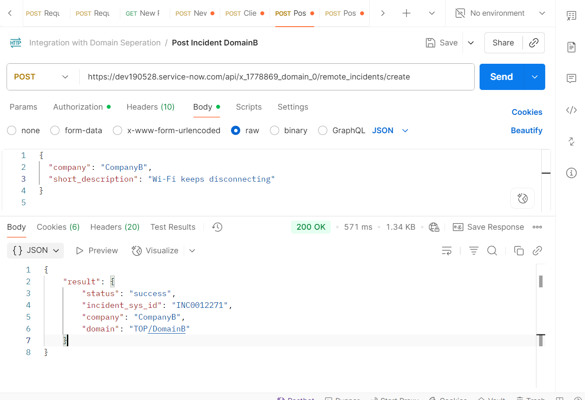
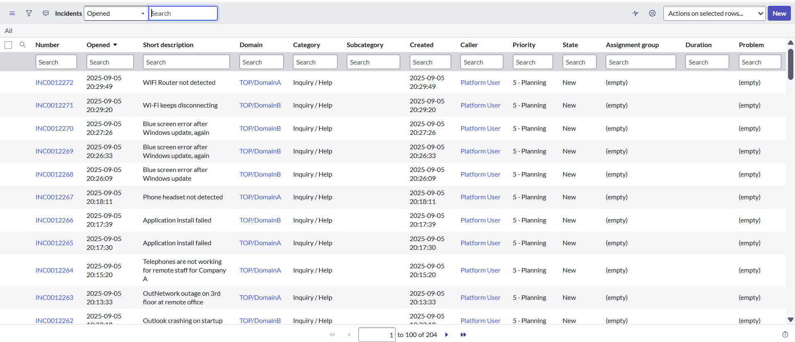

---
# Domain Aware Incident Integration (ServiceNow Scoped App)

## Overview

This project demonstrates how to build a **domain-aware integration** in ServiceNow.
It accepts incidents from external systems via a **Scripted REST API**, then routes them to the correct **domain** based on a company-to-domain mapping.

This is useful for **multi-tenant ServiceNow implementations** (e.g., Managed Service Providers), where each customer must have isolated data using **Domain Separation**.
---

## Features

- Scoped application (`x_yourname_domain_integration`)
- Custom **Domain Mapping Table** (`u_domain_mapping`)
- **Scripted REST API** (`POST /incident`)
- Auto-assigns incidents to correct `sys_domain`
- Tested with **Postman collection** for easy simulation
- Works with **Domain Separation plugin** enabled

---

## Architecture

**External System** (Postman / API client) → **ServiceNow Scripted REST API** → **Domain Mapping Table** → **Incident (sys_domain assigned)**

---

## Setup Instructions

### 1. Install Scoped App

1. Clone repo or import update set into your PDI.
2. Ensure **Domain Support – Domain Extensions** plugin is active.

### 2. Configure Domain Mapping

- Navigate to **Domain Mappings** module.
- Add records:

  - CompanyA → DomainA
  - CompanyB → DomainB

### 3. Use REST API

Endpoint:

```
POST https://<your-instance>.service-now.com/api/x_1778869_domain_0/remote_incidents/create
```

Headers:

```http
Content-Type: application/json
Accept: application/json
```

Authentication:

- OAuth 2.0

---

## Example Requests

### Create Incident for CompanyA

```json
{
  "company": "CompanyA",
  "short_description": "Server CPU usage high"
}
```

### Create Incident for CompanyB

```json
{
  "company": "CompanyB",
  "short_description": "Email outage in region"
}
```

---

## Example Responses

```json
{
    "result": {
        "status": "success",
        "incident_sys_id": "INC0012271",
        "company": "CompanyB",
        "domain": "TOP/DomainB"
    }
}
```

---

## Screenshots

- Domain Table  
  
- Postman Request  
  
- ACL  
  
- ACL  
  
- Incident Table
  
- **I did it! Domain Seperation, Integration, with OAuth too!**
  
---

## Learning Outcomes

- How to integrate ServiceNow with external systems using REST APIs
- How to enforce **domain separation** in integrations
- How to simulate **multi-tenant incident management** in a single instance
- How to package ServiceNow work into a **scoped app** for reusability

---

## Next Steps

- Extend app to support **Problem/Change** records
- Add **OAuth 2.0 authentication** for API
- Create **ATF (Automated Test Framework)** tests for regression

---
